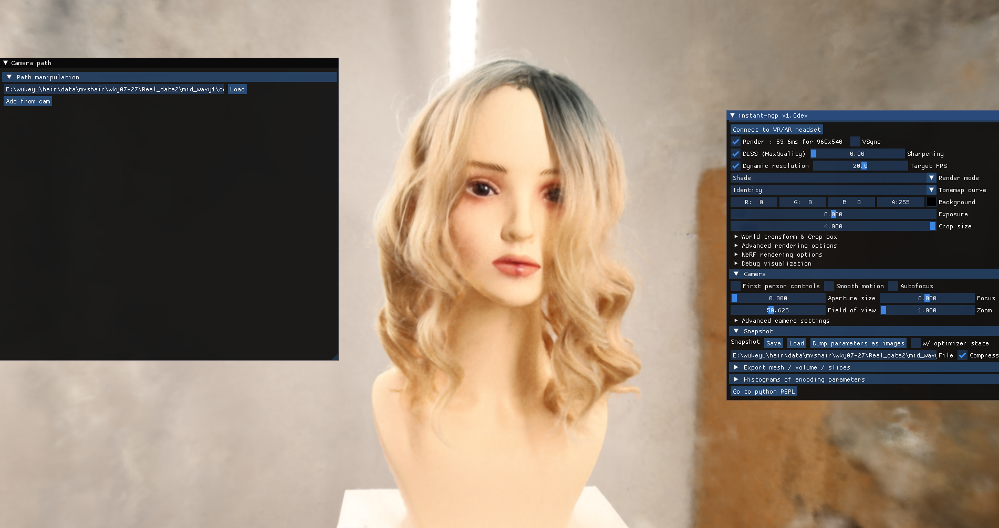
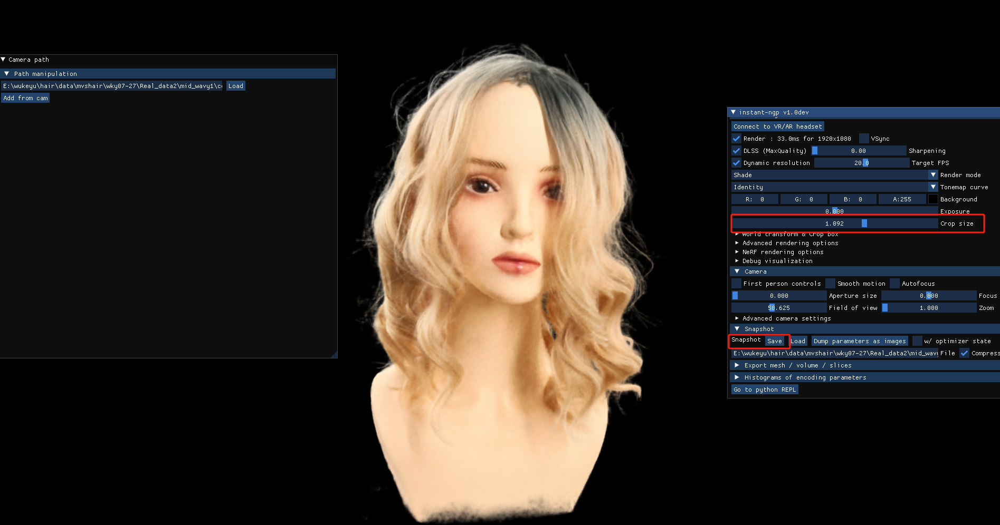
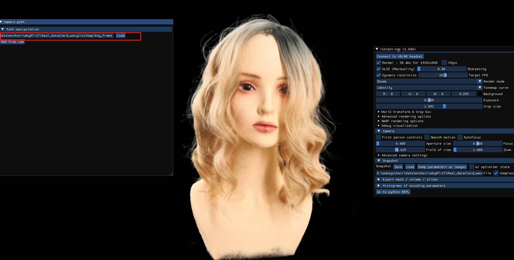

# Test your own video #
If you want to test your own data, you should refer to the following steps:

1. Select about 300-600 images from video. Set the path of video and run process_video.py to get 300-600 frames.

	`process_video.py `
2. Download COLMAP.exe in Windows (also can be other platforms), run COLMAP.exe using the above images and export the model with .txt format. Just same with our given examples.
3. Run get transoform.json by running submodules/instant-ngp/scripts/colmap2nerf.py. You can also refer to the [instruction](https://github.com/NVlabs/instant-ngp/blob/master/docs/nerf_dataset_tips.md) of Instant-NGP. It is the same steps.
	
	`data-folder$ python [path-to-instant-ngp]/scripts/colmap2nerf.py --colmap_matcher exhaustive --run_colmap= --aabb_scale 32`
3. You must download [Instant-NGP.exe](https://github.com/NVlabs/instant-ngp) in Windows, drag the colmap folder (contain images folder and transform.json) to the instant-ngp program. After training 2-3 minutes, crop the bbox to clear up the background and then save the pretrained weight and add the key frame in front view.

- Run instant-ngp.exe

- Crop the bbox size to clear the background and save the pretrained weight. You will get "base.ingp" in "colmap folder"

- Change the path as "key_frame.json" in Camera path tool.

- Select a suitable front view as the key frame (We will create 16 fixed views base on it when using DeepMVSHair). Click "Add from cam" to add a key frame and click "Save" to save its camera parameters. Then you will get "key_frame.json"
- 

After the above steps, you should have colmap_text folder, transofrm.json, base.ingp, key_frame.json. you can continue the process in the [main](https://github.com/KeyuWu-CS/MonoHair) page.